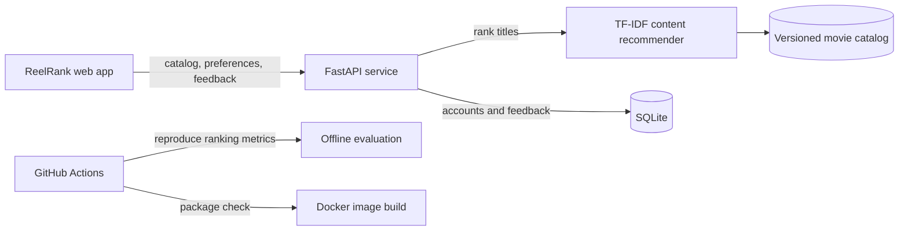

# ReelRank — MLOps Movie Recommendation Project

**Course:** Machine Learning Operations (24SDAD03)  
**Project type:** Content-based movie recommendation web application

## 1. Problem definition and literature survey

Movie catalogs are large, and a viewer's mood or taste is difficult to express with a simple search box. ReelRank addresses this discovery problem by turning a small set of liked titles into a ranked list of similar movies. It also lets viewers dismiss titles and save a personal watchlist. The current demo uses a versioned sample catalog and local user identifiers; it is an educational prototype rather than a production service.

Recommender-system research commonly distinguishes content-based, collaborative-filtering, and hybrid methods. Content-based systems build item and user representations from item attributes, which makes them useful when interaction histories are sparse and recommendations need to be grounded in item metadata [1, 2]. Collaborative filtering can use patterns across users, but its effectiveness depends on interaction data and introduces evaluation choices beyond a single score [2, 3]. ReelRank therefore starts with a content-based baseline and records explicit feedback so collaborative or hybrid methods can be evaluated later.

The implementation represents each movie using its genres, keywords, and overview text. TF-IDF weighting reduces the influence of terms shared by many titles; cosine similarity ranks candidates against the viewer's liked-title profile. A modest rating prior provides a tie-breaking quality signal. This approach is compact, interpretable, and fast for a small catalog. It has familiar limitations: metadata quality controls recommendation quality, new items can be recommended without interaction history but new users still need to choose titles, and the model does not learn cross-user taste patterns.

### Selected references

1. M. J. Pazzani and D. Billsus, “Content-Based Recommendation Systems,” in *The Adaptive Web*, LNCS 4321, pp. 325–341, 2007. [https://doi.org/10.1007/978-3-540-72079-9_10](https://doi.org/10.1007/978-3-540-72079-9_10)
2. G. Adomavicius and A. Tuzhilin, “Toward the Next Generation of Recommender Systems: A Survey of the State-of-the-Art and Possible Extensions,” *IEEE Transactions on Knowledge and Data Engineering*, 17(6), pp. 734–749, 2005. [https://doi.org/10.1109/TKDE.2005.99](https://doi.org/10.1109/TKDE.2005.99)
3. J. L. Herlocker, J. A. Konstan, L. G. Terveen, and J. T. Riedl, “Evaluating Collaborative Filtering Recommender Systems,” *ACM Transactions on Information Systems*, 22(1), pp. 5–53, 2004. [https://doi.org/10.1145/963770.963772](https://doi.org/10.1145/963770.963772)

## 2. Methodology, design, and technical approach

1. **Catalog:** `data/movies.json` is the version-controlled demo input. It contains 78 demo titles across 27 original languages; records include original-language titles and searchable movie metadata. Poster thumbnails are fetched at runtime from English Wikipedia's PageImages API, with generated artwork kept as a fallback.
2. **Feature pipeline:** `app/recommender.py` normalizes the text fields and builds TF-IDF vectors, then uses cosine similarity to rank the catalog.
3. **Personalization:** Likes become positive profile signals. Dislikes and watchlisted titles are excluded from future recommendation results. A user can remove a saved title or unlike a favorite.
4. **Service:** FastAPI serves the static UI and JSON routes for account registration/login, health, movies, user preferences, recommendations, watchlists, feedback, and aggregate metrics. Signed-in accounts are scoped to their own profile routes.
5. **Persistence and monitoring:** SQLite stores account records and timestamped feedback events. Passwords use salted PBKDF2 hashes; a signed HttpOnly cookie carries the session. The live MLOps panel displays the data → TF-IDF → ranking → feedback → CI workflow, SQLite health, model/catalog metadata, aggregate feedback, API request volume, mean latency, and server errors.
6. **Delivery:** GitHub Actions evaluates the ranking baseline and builds the Docker image. Render serves the web app and performs the `/health` check. The API's OpenAPI page supports endpoint inspection.

### System flow

## 3. Implementation and technical skills

The responsive web UI supports a login/register page and an expanded Explore shelf with 78 catalog titles across 27 original languages, search across English and native titles, language and genre filters, and sorting by rating, release year, title, or runtime. Movie cards and detail dialogs display poster thumbnails when available. It also supports favorite selection, personalized recommendations, dismiss feedback, a persistent watchlist, and a live API status indicator. Feedback actions use the backend API, and account preferences persist in SQLite across page refreshes.

The backend validates feedback action names, verifies signed sessions, scopes profile access to the account, rejects unknown movie IDs, bounds recommendation limits, and exposes `/health` and `/api/metrics`. Health checks now include SQLite connectivity. Runtime request counts, mean latency, and 5xx counts are process-local, so they reset on restart and are intended for the educational demo. There is no feature-drift detector, alerting, or multi-instance metrics backend. The current app uses a shared local SQLite file without multi-instance database coordination or email verification; managed storage and an identity provider are recommended before a public production deployment.

## 4. Results and innovation

### Offline ranking check

The bundled deterministic evaluation holds out one known favorite for each of four synthetic user histories and asks whether it appears among the top five results. `py scripts/evaluate.py` produces the following figures on the current 78-title catalog:

| Metric | Result | Meaning |
| --- | ---: | --- |
| Precision@5 | 0.100 | 2 held-out hits across 20 recommendation slots |
| Hit rate@5 | 0.500 | 2 of 4 held-out titles appeared in the top five |
| Catalog coverage@5 | 0.231 | 18 of 78 catalog titles appeared across the lists |

These scores are a small reproducibility demonstration on synthetic histories, not evidence of real-world quality. Four users are too few for statistical conclusions, and the low Precision@5 indicates the recommender needs improvement. Compare future model versions against a popularity baseline on a larger, time-aware held-out dataset; report ranking quality, catalog coverage, and results by language.

### Product and MLOps contribution

The project connects the user feedback loop to a persistent profile and the recommendation endpoint, so likes, dislikes, and saved titles affect the next result set. It also has a deterministic evaluation script, live model/service monitoring, aggregate feedback metrics, a versioned input catalog, a container setup, and a documented API. GitHub Actions runs the offline evaluation and builds the Docker image on pushes and pull requests. Model artifact lineage, evaluation gates, feature-drift checks, and alerting remain future work.

## 5. Presentation and documentation

- Start instructions and API routes: `README.md`.
- Model and API implementation: `app/`.
- Versioned sample data: `data/movies.json`.
- Ranking evaluation: `scripts/evaluate.py`.
- Local container setup: `Dockerfile` and `docker-compose.yml`.
- Interactive API guide: `/docs` while the service is running.
- Automated workflow: `.github/workflows/docker-image.yml` installs dependencies, runs the offline ranking evaluation, and builds the Docker image.
- Demo walkthrough: register or log in, select a few favorite titles, inspect recommendations, filter Explore by language/genre, open a movie detail, add it to the Watchlist, then refresh and confirm it persists.

### Rubric coverage

| Review criterion | Project evidence |
| --- | --- |
| Problem definition and literature survey (20) | Problem statement, method selection rationale, and selected research references above |
| Methodology, design, and technical approach (20) | Catalog-to-feature-to-ranking pipeline, API, feedback persistence, and delivery design |
| Implementation and technical skills (25) | FastAPI backend, signed account sessions, TF-IDF recommender, SQLite store, responsive UI, Docker |
| Results, testing, and innovation (20) | CI evaluation, top-five ranking metrics, interactive feedback loop, health and metrics endpoints; evaluation data is only four synthetic histories |
| Presentation, documentation, and team contribution (15) | This report, README, API docs, demo walkthrough, and organized project structure; add the actual team member names and contribution evidence before submission |

### Submission readiness and remaining evidence

The implementation demonstrates the main product and engineering criteria, but this report does not claim a full score. To strengthen the review, expand the literature comparison beyond the selected foundational references; define measurable requirements and a baseline; evaluate more representative users and languages; include model/data version identifiers and a drift or input-quality check; and prepare a short slide deck or live demonstration. Record only actual team members and their real contributions in the submitted copy.
